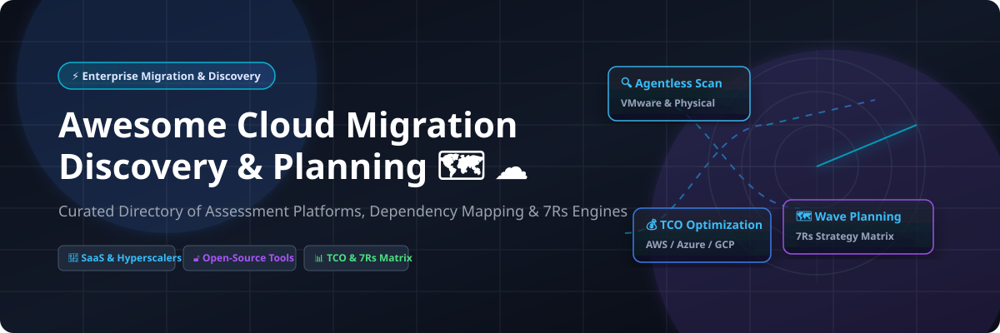

# Awesome-Cloud-Migration-Discovery-Planning

# Awesome-Cloud-Migration-Discovery-Planning 🗺️ ☁️



  





  
  
  
  
  
  



---

## 🌟 Top Cloud Migration Discovery & Planning Ecosystem

**Curated List of Commercial Migration Platforms & Open-Source Discovery Tools**  
*Focused on Agentless Discovery, Dependency Mapping, TCO Analysis, Migration Wave Planning & Self-Hosted Assessment Engines*

**Last updated: October 2026** 📅

---

### 📌 Overview & SEO Summary
Welcome to the ultimate curated directory of **cloud migration discovery platforms**, **open-source dependency mapping tools**, and **infrastructure assessment frameworks**. Whether you are looking for enterprise-grade commercial solutions (such as *AWS Application Discovery Service*, *Azure Migrate*, and *Flexera One*), or self-hostable open-source alternatives (like *Cartography*, *Cloud Migration MCP*, and *Mercator*), this list covers category leaders, 7Rs strategy engines, and privacy-respecting migration planning.

---

## 📑 Table of Contents
- [🏢 SaaS & Commercial Platforms](#-saas--commercial-platforms)
- [🔓 Open-Source GitHub Projects](#-open-source-github-projects)
- [🛠️ How to Contribute](#%EF%B8%8F-how-to-contribute)
- [📊 Star History](#-star-history)
- [🤝 Support & Sponsorship](#-support--sponsorship)
- [⚠️ Disclaimer](#%EF%B8%8F-disclaimer)

---

## 🏢 SaaS / Commercial Platforms

The cloud migration discovery and planning market spans **hyperscaler native tools** (AWS, Azure, Google) that provide **free discovery and assessment** with consumption-based pricing for underlying resources, and **specialized third-party platforms** (Device42, Flexera, Turbonomic) that offer **deeper dependency mapping and multi-cloud cost comparison**. **AWS Application Discovery Service** is **free** — you only pay for underlying S3 storage and Athena queries . **Azure Migrate** is also **free** for discovery, assessment, and migration planning, with partner tools potentially charging for their services . **Google Cloud Migration Center** provides **default 5-year timeline projections** with **15% completion in year 1, 30% in year 2, 50% in year 3, 75% in year 4, and 100% in year 5** .

| SaaS / Commercial Platform | Company / Owner | Valuation / Market Cap | Standard Edition Starting Price | Free Tier / Free Trial Limits | Description |
| :--- | :--- | :--- | :--- | :--- | :--- |
| **[AWS Application Discovery Service](https://aws.amazon.com/application-discovery/)** ☁️ | Amazon | ~$2.0 Trillion | **Free service**; pay only for underlying S3, Athena, Kinesis | **Free forever** (discovery itself) | **AWS-native discovery** — **Agentless Collector (OVA)** for VMware vCenter gathers configuration and utilization data without installing agents . **Agent-based discovery** installs on physical/VM/EC2 for detailed process and network connection data . **Data stored in Migration Hub home Region** . |
| **[Azure Migrate](https://azure.microsoft.com/en-us/products/azure-migrate/)** 🔷 | Microsoft | ~$3.90 Trillion | **Free service**; partner tools may charge  | **Free forever** (discovery, assessment, planning)  | **Azure-native migration hub** — **Unified platform** for servers, databases, web apps, and virtual desktops . **Azure Copilot migration agent (preview)** provides conversational planning using project data . **Azure Migrate collector** for air-gapped/restricted networks . |
| **[Google Cloud Migration Center](https://cloud.google.com/migration-center)** 🌐 | Google (Alphabet) | ~$2.0 Trillion | **Free assessment**; pay for underlying GCP resources | **$300 free credits** for new customers | **GCP-native migration planning** — **StratoZone** agentless discovery with **StratoProbe data collector** (installs in <45 min) . **5-year default timeline** with configurable cumulative completion percentages . **1:1 cost comparison** via RVTools and ServiceNow imports . |
| **[IBM Turbonomic](https://www.ibm.com/products/turbonomic)** ⚙️ | IBM | ~$200 Billion | **Custom enterprise pricing** | **30-day free trial** | **Application resource management** — **Migration planning with Lift & Shift vs Optimized scenarios** . **Optimized migration** analyzes historical utilization to recommend right-sized cloud instances, showing **cost savings opportunities** . **RI purchase recommendations** with break-even analysis . |
| **[Flexera One Cloud Migration Planning](https://www.flexera.com/)** 📊 | Flexera | Private (est. ~$500M revenue) | **Custom enterprise pricing**; no free version | **No free trial** | **Multi-cloud migration planning** — **Workload placement** with full visibility into current workloads . **Cloud cost comparison** across providers to inform migration decisions . **Application dependency mapping** to understand business service impact . |
| **[Device42](https://www.device42.com/)** 🔍 | Device42 | Private | **Custom enterprise pricing** | **Trial available** | **Discovery and dependency mapping** — **Agentless discovery** of on-premises infrastructure and applications . **Cloud Recommendation Engine** produces Azure sizing and cost estimates . **Integrates with Azure Migrate** as a workload migration assistance provider . **ADM feature** for resource utilization analysis (RAM, CPU, IOPS) . |
| **[RISC Networks CloudScape](https://riscnetworks.com/)** 📡 | RISC Networks | Private | **Custom pricing** | **Demo available** | **Cloud assessment and migration planning** — **Agentless discovery** provides view of environment . **Score values indicate best opportunity** for PaaS, rehost, replatform, or retain . **Reduces IaaS by average 66%** through right-sizing and cost comparison . **Used by Turner Broadcasting** to identify 1,000 servers running but not utilized . |
| **[CAST Highlight](https://www.castsoftware.com/)** 🎯 | CAST Software | Private | **Custom enterprise pricing** | **Demo available** | **Application portfolio assessment** — **Scans source code** for cloud maturity, blockers, and open source risks . **5R disposition recommendations** with migration/现代化 waves . **Cloud blocker remediation effort estimates**. **Benchmarked against industry peers** . |
| **[Tidal Cloud](https://www.tidalcloud.com/)** 🌊 | Tidal | Private | **Custom pricing** | **Demo available** | **Migration management platform** — Enterprise migration orchestration and tracking. |

---

## 🔓 Open-Source GitHub Projects

*Sorted by GitHub_Stars_Count (Descending)* 🌟

- **[Cartography](https://github.com/lyft/cartography)**   
  **Infrastructure asset and relationship mapping**, Apache-2.0 licensed. **Consolidates infrastructure assets and relationships in an intuitive graph view powered by Neo4j** . **Supports AWS, Azure, GCP, Kubernetes, Okta, and more** — 30+ platforms . **Exposes hidden dependency relationships** to validate security risk assumptions. **Service owners generate asset reports, Red Teamers discover attack paths, Blue Teamers identify security improvements** . **Python-based, battle-tested in production** . **The foundational open-source infrastructure graph tool for migration dependency mapping**. 🗺️

- **[Cloud Migration MCP](https://github.com/chrishorne74/cloud-migration-mcp)**   
  **MCP server for cloud migration assessment, strategy, and planning**, open-source. **7 Rs Strategy Engine** recommends Rehost, Replatform, Repurchase, Refactor, Retire, Retain, or Relocate based on workload attributes . **Migration Assessment** scores workloads **0–100 across 10 industry-standard criteria** (business criticality, complexity, vendor support, cloud readiness, cost, age, SaaS availability, data sensitivity, documentation, compliance) . **30+ built-in guardrails** across Dependency, Security, Compliance, Data, Architecture, Operations, and Cost categories . **Candidate Scoring & Ranking** for up to 50 workloads. **Wave Planning** groups workloads respecting dependencies. **Cost Estimation** with ROM (±50%) and ROI break-even. **Draw.io Diagrams** with native AWS/Azure/GCP shapes. **The most comprehensive open-source migration planning engine** — agent-ready with MCP protocol. 🚀

- **[Mercator](https://github.com/dbarzin/mercator)**   
  **Information system mapping and governance**, open-source. **"The best open source tool for information system mapping and governance"** . **Aligned with ANSSI's Mapping the Information System Guide** (French cybersecurity agency) . **Comprehensive visualizations**: logical, administrative, and physical infrastructure views. **Architecture reports** generated automatically. **Compliance monitoring** with CVE-Search integration for vulnerability scanning . **REST API** with JSON support. **Multi-user with RBAC**, LDAP/Active Directory integration. **PHP/Laravel backend, MariaDB/MySQL/PostgreSQL/SQLite** . **The most governance-focused open-source system mapping tool**. 🏛️

- **[SWAO (Accenture)](https://github.com/Accenture/SWAO)**   
  **AI-accelerated cloud workload compliance assessment**, open-source (Community Edition). **Static passes complete in ~30 seconds**; **LLM passes take 3–8 minutes** depending on codebase size . **CLI, TUI, MCP server, and PowerBI exports** for different user personas . **PowerBI templates** for App Report, Portfolio Overview, Auditor View, and Compliance Matrix (GDPR/HIPAA/PCI DSS/ISO 27001) . **Docker quick-start** with multi-arch image (amd64/arm64) . **The most accessible open-source compliance assessment tool** for migration workloads. 🛡️

---

## 🛠️ How to Contribute

Contributions are welcome! Follow these steps to submit new migration discovery platforms or open-source assessment software:

1. 🍴 **Fork** the repository.
2. 📝 **Add/edit** entries in `README.md` maintaining table/list structure and formatting.
3. 🔗 Include project title, official website/GitHub link, exact Stars_Count, license, and brief description.
4. 🚀 Submit a **Pull Request** with a descriptive summary of your changes.

---

## 📊 Star History



---

## 🤝 Support & Sponsorship

If you find this cloud migration discovery repository useful, please consider supporting the project:

- ⭐ **Star** this repository to increase visibility!
- 🔀 **Fork** and share with fellow migration architects, platform engineers, and open-source advocates.
- ☕ **Sponsor & Buy Me a Coffee**: Support ongoing open-source curation via the [GitHub Sponsor Dashboard](https://github.com/sponsors/ishandutta2007).

---

## ⚠️ Disclaimer

- This is a **community-curated** list — not exhaustive and not an endorsement. ℹ️
- **AWS Application Discovery Service is free** for discovery — you only pay for underlying S3 storage and Athena queries used to analyze exported data . **Azure Migrate is free** for discovery, assessment, and planning, but **partner tools integrated into the hub may charge separately** .
- **Google Cloud Migration Center defaults to a 5-year timeline** with **15% completion in year 1** and **100% in year 5** — adjust based on your organization's migration velocity . **StratoZone agentless discovery completes in <45 minutes** for installation and **hours for data collection from thousands of assets** .
- **Device42 dependency mapping requires manual identification** according to user reviews — the feature "needs improvement as it currently requires manual identification of device relationships" . **Flexera One migration planning initial step is "very time consuming and tedious"** per Gartner Peer Insights .
- **Open-source tools (Cartography, Cloud Migration MCP, Mercator) are not turnkey** — **Cartography requires Neo4j** and Python expertise . **Cloud Migration MCP requires MCP client integration** . **Mercator requires PHP/Laravel deployment** . **Always validate migration plans with a proof-of-concept** before committing to production timelines. 🗺️

---



  <b>Made with ❤️ for migration architects, platform engineers, and open-source discovery advocates.</b>

